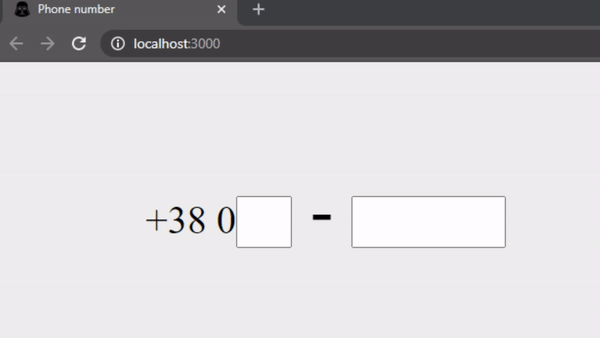

# React online marathon

## The tasks of the topic Ref:

### Modify React Element `Input`:
- Only natural numbers can be entered in the fields. All the rest characters shoulkd be ignored. *Use regular expressions for this.*
- When page is loaded, first input *(operator field)* are focused. *Use `ref` for this.*
- If the **User** enters 2 numbers in the operator field, the name of the corresponding mobile operator will appear and the cursor focus will move to the next input field *(ref using)*. Mobile operators:
  - `Kyivstar`: 67, 68, 96, 97, 98
  - `Vodafone`: 50, 66, 95, 99
  - `Lifecell`: 63, 73, 93
  - `3mob`: 91
  - `People.net`: 92
  - `intertelecom`: 89, 94
  - `Unknown`: other 2 digit numbers
- If the **User** entered 2 numbers in the operator field and 7 numbers in the phone field, then `-` will be replaced by `✔️` in `.check-icon` element.
- Modify only *./components/input/input.js*.
- Use *onInput* event listenets for inputs.
- Save *html* structure of `Input` and do not delete data-testid attributes. They will be used for testing.

*You can use functional component for the solution*
